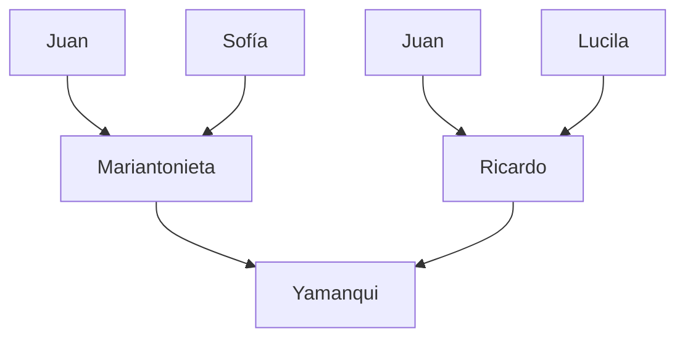

## ¡Hola! 👋
<picture>
 <source media="(prefers-color-scheme: dark)" srcset="https://octodex.github.com/images/yogitocat.png" width=200>
 <source media="(prefers-color-scheme: light)" srcset="https://octodex.github.com/images/universetocat.png" width=200>
 
</picture>

## Sobre mí

Soy Yamanqui, maestro de matemáticas de secundaria. Estoy tratando de aprender más sobre GitHub para 
que mis alumnos también puedan usarlo.

### Lenguajes de progrmación

Mi experiencia

| Conocimiento | Lenguaje    |
|-------------:|-------------|
| 75%          | C           |
| 50%          | C++         |
| 80%          | Java        |
| 70%          | JavaScript  |
| 80%          | Objective-C |
| 90%          | Python      |
| 50%          | Swift       |
| 20%          | Ruby        |
| 30%          | Bash        |

### Familia

### Matemáticas

Mi número favorito es $e$

Mi fórmula favorita es  
$$e^{i\pi}$$

---
> No quiero la importalidad a través de mi trabajo, quiero la importalidad no muriendo.

— Woody Allen

<!--
**YamanquiChacala/YamanquiChacala** is a ✨ _special_ ✨ repository because its `README.md` (this file) appears on your GitHub profile.

Here are some ideas to get you started:

- 🔭 I’m currently working on ...
- 🌱 I’m currently learning ...
- 👯 I’m looking to collaborate on ...
- 🤔 I’m looking for help with ...
- 💬 Ask me about ...
- 📫 How to reach me: ...
- 😄 Pronouns: ...
- ⚡ Fun fact: ...
-->
